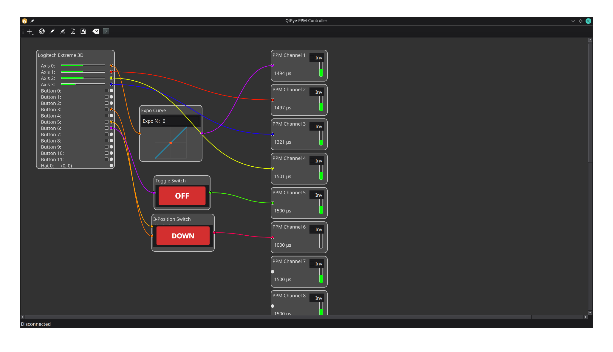

# QtPye-PPM-Controller 🎮

A flexible, node-based graphical interface for creating custom remote control setups. This application reads input from a standard USB joystick and outputs a configurable PPM (Pulse-Position Modulation) signal via a serial-connected hardware adapter.

It's ideal for controlling FPV drones, RC cars, and other robotics projects from a Raspberry Pi or desktop computer, giving you complete control over your channels and logic.


*(Example of an FPV drone layout using the Expo, Toggle, and 3-Position Switch nodes)*

## Features

* **Node-Based Editor:** Visually create your control logic by connecting nodes together.
* **Real-time Input:** Live visualization of joystick axes and button states.
* **8-Channel PPM Output:** Configure up to 8 channels for your PPM signal.
* **Modular Logic Nodes:** A powerful set of nodes to customize your controls:
    * Expo Curve
    * Channel Mixer
    * Toggle Switch (Momentary to Latching)
    * 3-Position Switch
    * Boost Control
    * Custom Math Formulas
* **Save & Load:** Save your complex node layouts to a `.json` file and have them load automatically on startup.
* **Debugging Console:** A built-in serial console to monitor the raw commands being sent to your hardware.

---

## Requirements

* Python 3.x
* A USB Joystick
* A USB-to-PPM hardware adapter (e.g., PiKoder USB2PPM)
* The following Python libraries:
    * PyQt5
    * Pygame
    * Pyserial

---

## Installation

1.  **Clone the repository:**
    ```bash
    git clone https://github.com/Rec0iL/QtPye-PPM-Controller
    cd QtPye-PPM-Controller
    ```

2.  **Install the required libraries:**
    ```bash
    pip install pyqt5 pygame pyserial
    ```

---

## Usage

1.  **Run the application:**
    ```bash
    python main.py
    ```
    or use the included start script:
    ```bash
    ./start.sh
    ```
2.  **Connect Hardware:** Use the **Select Port** button to choose the correct serial port for your PPM adapter, then click **Connect**.
3.  **Build Your Layout:**
    * Add new logic nodes using the **Add Node** dropdown menu.
    * Click and drag from an output dot (right side of a node) to an input dot (left side) to create a connection.
    * Select a custom node and press the **Delete** key to remove it.
4.  **Save Your Work:** Click the **Save Layout** button. Your layout will be saved to `layout.json` and will be loaded automatically the next time you start the app.

---

## Nodes Overview

* **Joystick:** The main input node, showing all detected axes and buttons.
* **PPM Channel:** An output node that sends the final value for a specific channel to the hardware.
* **Expo Curve:** Applies an exponential curve to a joystick axis for finer control around the center.
* **Mixer:** Mixes two inputs to two outputs. Essential for vehicles like flying wings (elevons) or V-tails.
* **Toggle Switch:** Converts a momentary button press into a persistent ON/OFF switch.
* **3-Position Switch:** Uses two buttons to cycle through three states (UP, MIDDLE, DOWN), outputting `1.0`, `0.0`, and `-1.0`.
* **Boost Control:** Provides a temporary "boost" to an output value for a set duration, followed by a cooldown.
* **Custom Logic:** A powerful node for applying custom mathematical formulas to one or two inputs.

---

## Layout Presets

This repository includes a `layout_presets` folder with pre-configured setups for common use cases.

* `layoutFPV.json`: A standard layout for an FPV drone, using expo on the main axes and switches for arming and flight modes.
* `layoutRCCarWithBoost.json`: A layout for an RC car with steering, a throttle channel that uses the Boost node for a temporary speed increase.

**To use a preset:**

1.  Copy the desired file (e.g., `layoutFPV.json`) from the `layout_presets` folder into the main project directory.
2.  Rename the copied file to **`layout.json`**, replacing the existing one if it's there.
3.  Restart the application. The preset layout will be loaded automatically.

---
