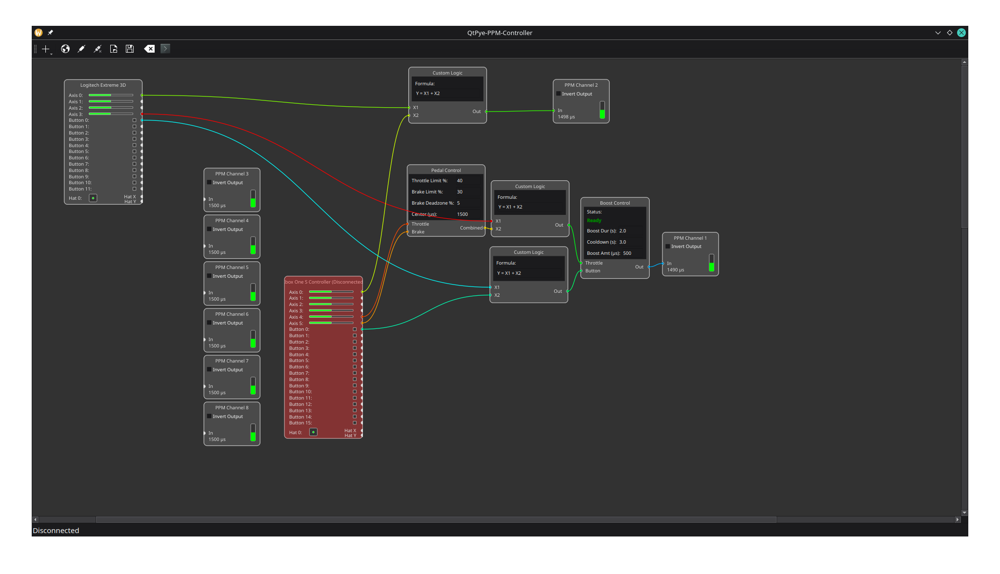

# QtPye-PPM-Controller 🎮

A flexible, node-based graphical interface for creating custom remote control setups. This application reads input from standard USB joysticks, gamepads, and steering wheels and outputs a configurable PPM (Pulse-Position Modulation) signal via a serial-connected hardware adapter.

It's ideal for controlling FPV drones, RC cars, and other robotics projects from a Raspberry Pi or desktop computer, giving you complete control over your channels and logic.


*(Example of an RC Car layout controlled by 2 input devices simultaneously using the Custom Logic, Pedal Control and Boost Control nodes)*

## Features

* **Node-Based Editor:** Visually create your control logic by connecting nodes together.
* **Multi-Device Support:** Connect and use multiple joysticks, gamepads, or steering wheels in the same layout.
* **Robust Hotplugging:** `Joystick` nodes can be disconnected and reconnected on the fly. Layouts can be loaded even if a device is missing, creating a placeholder that connects automatically when the device is plugged in.
* **Enhanced UI:** Features interactive highlighting of connections and a "ghost" preview that snaps to valid connection points, making it easier to build complex setups.
* **Real-time Input:** Live visualization of joystick axes and button states.
* **8-Channel PPM Output:** Configure up to 8 channels for your PPM signal.
* **Modular Logic Nodes:** A powerful and expanding set of nodes to customize your controls.
* **Save & Load:** Save your complex node layouts to a `.json` file and have them load automatically on startup.
* **Debugging Console:** A built-in serial console to monitor the raw commands being sent to your hardware.

---

## Requirements

* **A Computer or Single-Board Computer:** The application runs on **Windows** or **Linux** PCs. It is also compatible with single-board computers like the **Raspberry Pi 3, 4, or 5**, as well as the **Orange Pi** series.
* **Python 3.x:** A working Python 3 installation is required.
* **A USB Input Device:** Any device recognized as a game controller, such as a **gamepad, joystick, steering wheel, or flight stick**.
* **A USB-to-PPPM Hardware Adapter:** A device to convert the signal, such as the **PiKoder USB2PPM**.
* **Python Libraries:** The following must be installed: **PyQt5, Pygame, and Pyserial**.

---

## Installation

1.  **Clone the repository:**
    ```bash
    git clone [https://github.com/Rec0iL/QtPye-PPM-Controller.git](https://github.com/Rec0iL/QtPye-PPM-Controller.git)
    cd QtPye-PPM-Controller
    ```

2.  **Create and activate a virtual environment (Recommended):**
    ```bash
    python3 -m venv venv
    source venv/bin/activate
    ```

3.  **Install the required libraries:**
    ```bash
    pip install pyqt5 pygame pyserial
    ```
    *(Note: On Raspberry Pi, you may need to install PyQt5 via `apt` first: `sudo apt install python3-pyqt5`)*

---

## Usage

1.  **Run the application:**
    ```bash
    python main.py
    ```
    or use the included start script:
    ```bash
    ./start.sh
    ```
2.  **Connect Hardware:** The app will attempt to auto-connect to `/dev/ttyACM0`. If that fails, use the **Select Port** button to choose the correct serial port for your PPM adapter, then click **Connect**.
3.  **Build Your Layout:**
    * Add new logic nodes using the **Add Node** dropdown menu.
    * Click and drag from an output dot (right side of a node) to an input dot (left side) to create a connection.
    * Select a custom node and press the **Delete** key to remove it.
4.  **Save Your Work:** Click the **Save Layout** button. Your layout will be saved to `layout.json` and will be loaded automatically the next time you start the app.

---

## Nodes Overview

* **Joystick:** The main input node, showing all detected axes, buttons, and hats for a specific device.
* **PPM Channel:** An output node that sends the final value for a specific channel to the hardware.
* **Expo Curve:** Applies an exponential curve to a joystick axis for finer control around the center.
* **Mixer:** Mixes two inputs to two outputs. Essential for vehicles like flying wings (elevons) or V-tails.
* **Toggle Switch:** Converts a momentary button press into a persistent ON/OFF switch.
* **3-Position Switch:** Uses two buttons to cycle through three states (UP, MIDDLE, DOWN).
* **Boost Control:** Provides a temporary "boost" to an output value for a set duration, followed by a cooldown.
* **Custom Logic:** A powerful node for applying custom mathematical formulas to one or two inputs.
* **Axis to Buttons:** Converts a single analog axis into two separate button outputs (one for the positive direction, one for the negative) with a configurable deadzone.
* **Switch Gate:** Acts as an A/B switch, routing one of two data inputs (A or B) to the output based on a third switch input. Perfect for dual rates.
* **Pedal Control:** A specialized node for combining separate throttle and brake pedal axes into a single, unified output, with individual limits and a brake activation deadzone.

---

## Layout Presets

This repository includes a `layout_presets` folder with pre-configured setups for common use cases.

* `layoutFPV.json`: A standard layout for an FPV drone, using expo on the main axes and switches for arming and flight modes.
* `layoutRCCarWithBoost.json`: A layout for an RC car with steering, a throttle channel that uses the Boost node for a temporary speed increase.

**To use a preset:**

1.  Copy the desired file (e.g., `layoutFPV.json`) from the `layout_presets` folder into the main project directory.
2.  Rename the copied file to **`layout.json`**, replacing the existing one if it's there.
3.  Restart the application. The preset layout will be loaded automatically.

---

## License

This work is licensed under the Creative Commons Attribution-NonCommercial-ShareAlike 4.0 International License.
